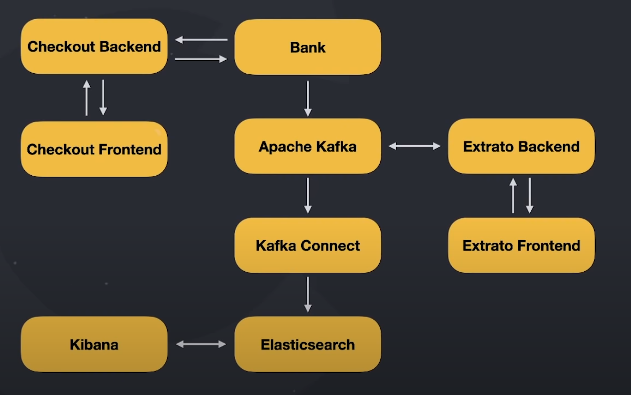

- [Microsservices FullCycle Bank](#microsservices-fullcycle-bank)
  - [Dynamic](#dynamic)
  - [Technologies](#technologies)

# Microsservices FullCycle Bank

## Dynamic

## Technologies

- Bank: [GoLang](https://golang.org/)
- Backend - Checkout and Extrato: [Nest.js](https://nestjs.com/)
- Frontend - Checkout and Extrato: [Next.js](https://nextjs.org/)
- [Kafka](https://kafka.apache.org/) & [Kafka Connect](https://docs.confluent.io/platform/current/connect/index.html)
- [Elasticsearch](https://www.elastic.co/pt/) & [Kibana](https://www.elastic.co/pt/kibana/)
- Docker & Kubernetes
- Monitoring: Istio, Prometheus, Kiali & Grafanall
